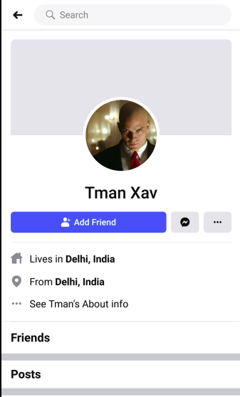

# #CTFFriday 2020JuneWeek2 

* Date: 12th June 2020
* Time: 2:00 to 3:00 PM

## Organized By

   

 <span style="color:red"> Net Square Solutions Pvt. Ltd.</span>                              

## About Me

Hi,

I am [Smit Patel](https://twitter.com/smit_2307) and I am currently working as a Security Analyst at  [Net Square Solutions Pvt. Ltd.](https://net-square.com) I participated in ctf as ```sk```

## Overview

This ```CTF``` is build by [Aman Barot](https://twitter.com/AmanBarot12). There were 3 challenges based on Cryptography and OSINT(Open-source intelligence).Open Source Intelligence (OSINT) is nothing but an intelligence discipline that generates insight from publicly available information.

<h3>Challenge-1</h3>

**Hints :**

* Two popular hashing algorithms are used to keep the secret from you.
Might be useful: [https://md5hashing.net](https://md5hashing.net)
* Look for hashes in the provided folder, it will lead you to more information.

**Flag 1 :** 30 Points 

**Description :**

* This challenge is based on cryptography. For the first flag we have to download one zip file named `find_the_hitman.zip`. After extracting zip file i got number of folders. In that folders i opened `etc` folder.

 

* In that folder there was a one text file named `shadow`.

  

* From the hint i got to know that i have to find some hash values from that text file. Then i observed that text file and got some hash values in two strings. Then i opened one link which was provided in hint and tried to decrypt that hash values one by one. 

 

* when i decrypted the first hash value which was encrypted by `SHA512` i got some text like `tman.xav.7`. 

 

* When i decrypted the second hash value which was encrypted by `SHA384` i got the first flag.

 

* **`nsctf{Flag_is_here}`**

<h3>Challenge-2</h3>

**Hints :**

* Use your OSINT skills to find Mr. Hitman Xavier.
* Find the presence of Mr. Hitman Xavier on social media. 
* look for path Flag.

**Flag 2 :** 70 points

**Description :**

* This challenge is based on OSINT(Open-source intelligence). From the given hint i got to know that in any social media there was a one account named `Mr. Hitman Xavier`. And from the previous challenge i got one text from the hash value which was `tman.xav.7`. then i started searching that text on every social media. And from the `facebook` i got one profile named `Tman Xav`.

 

* In the `About` section i got one instagram link for username `hitmanxavier1`.

 

* After that i navigated to the instagram profile for that user but there was only one video file.

 

* From the hint i got to know that i have to find that username on another social media as well as. So i searched that username in another social media named `twitter` . And i found one profile.

 

* After that i opened that profile and i got one picture and that picture contain some urls and path.

 

* Then i observed the screenshot in that screenshot one `flag.php` file is called on ip `18.210.19.150`. Then i opened following url `http://18.210.19.150/flag.php`. And i got second flag but something missing in that flag we have to find ASN for that Ip Address.

 

* For that ASN i opened `shodan` and type the following ip address `18.210.19.150` and i got the information about ip address as well as ASN details. Then i got the second flag.

 

* **`nsctf{Th!s _ !s _ th3_ First_ Fl@g!_ AS14618}`**

<h3>Challenge-3</h3>

**Hints :**

* Look for Mr. Hitman Xavier's followers.

**Flag 3 :** 100 points 

**Description :**

* Third challenge is also based on OSINT(Open-source intelligence). For this challenge I have to look for the user `hitmanxavier1`'s followers that i got to know from the hint. So i opened that user profile.

 

* After that i opened followers list. From that follower list i found one follower named `Kabir Singh`

 

* Then i opened that user's tweet and i found one link. 

 

* Then i opened that link and that link conatains some password policies and tried all the password one by one to access user `kabir singh`'s account. From that passwords i found one valid password that was `P@ssword234`. by using that password i logged in.

 

*  After logged in i opened messages tab that conitained one chat.

 

* When i opened that chat i found one ip address `100.25.197.85`, one file name `secret` and one password `hitmanxavier`.

 

*  Then i opened this url `http://100.25.197.85/secret` and i found one zip file and downloaded it.

 

* After i extracted that zip file. That zip file contained another 60 zip files and all these zip files are password protected. 

 

* Then i used one simple bash script to unzip all the 60 files with the password `hitmanxavier` that i got from the user chat.

* I used following script :

 `for i in {0..60}; do unzip -P 'hitmanxavier' Flag.$i.zip; done`

 

* I observed that `Flag.51.zip` extracted and it contain one text file named `Flag.txt`.

 

* By opening that text file i got the third flag.

 

* **`nsctf{Capture_ th3_ fl@g!}`**

--------

It was a very nice CTF by [Aman Barot](https://twitter.com/AmanBarot12). Personally i liked third challenge. We had learnt lots of new things.

Here are the scoreboard of CTF. 
 
 

 